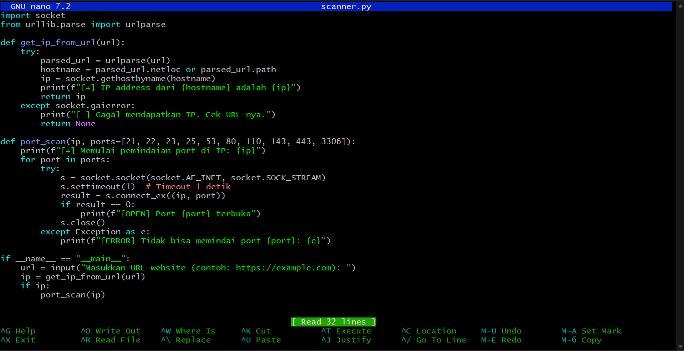
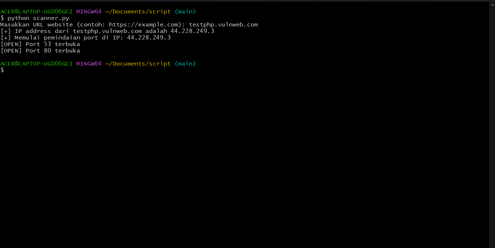

# 🔍 IP & Port Scanner

Script Python sederhana untuk:
- Mendapatkan alamat IP dari sebuah URL website
- Melakukan scanning beberapa port umum di IP tersebut

---

## 🛠 Cara Menjalankan

## Dokumentasi Langkah

### Langkah 1


### Langkah 2


### Langkah 3


### Langkah 4


```bash
python scanner.py
